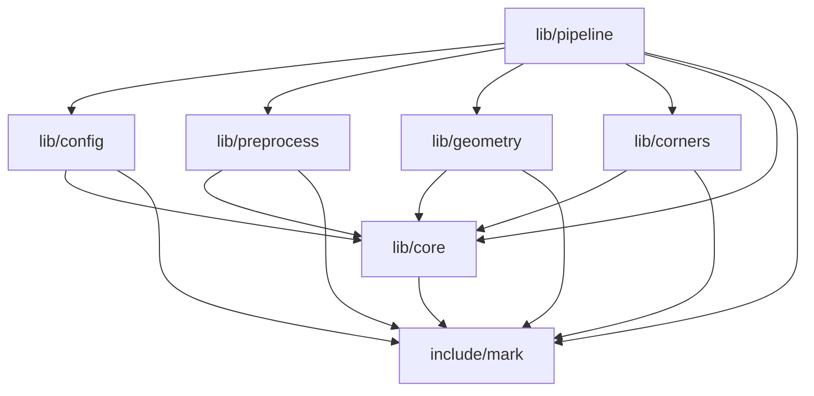

# src/tushenghao include依赖与目录划分建议

> 此方案已获用户批准并实施；[目录重组记录](layout-reorganization.md)给出新布局和验证。以下保留批准时的分析快照。

2026-10-06。本轮仅分析并生成报告；所有C++源文件、头文件、CMake与既有归档均未改变。下列是待用户批准的搬迁方案，不是已实施结构。

## 范围与方法

递归扫描包含gitignore忽略的旧参考合成器，共93个手写C/C++源/头文件：根目录46、tests17、tools9、tools/synth_ref19、docs/evidence2。另发现6个build目录中的编译器识别/生成头，列入清单但不作为手写模块；build_info.hpp.in模板无include，单独归生成规则。四个Python工具没有C++include，列入工具归属，不参与边数统计。

去除块/行注释后提取include，保留行号；按当前文件目录、主工程include根、synthetic_gen/include解析本地路径。尤其config.cpp末尾旧骨架和测试注释中的include不计入。结果为228条本地include指令、227条不同文件对，无文件级include环。标准库/OpenCV/JSON/OpenSSL分别记录在JSON，不展开系统头递归。

这是**源码直接include关系及其传递闭包**，不是调用图、链接符号图或重编译耗时测量。条件分支取并集；历史ms_stage_diagnose.cpp的MS_BASELINE_HEADER仅记录宏依赖，没有伪造目标。records.cpp依赖CMake生成的synthetic_gen/build_info.hpp，单独记录。没有无法解析的普通引号include。

- [全部93文件、带行号边、传递依赖、外部依赖、SHA256](include-dependency-graph.json)
- [直接边CSV](include-dependency-edges.csv)
- [完整文件图DOT](include-dependency-graph.dot)：箭头为“包含者→被包含者”，clusters是下文建议归属；图内节点仍是当前真实路径。

## 建议：六个内部模块，公开头与内部头分开

主工程建议`lib/`下6个模块目录；另设`include/mark/`公开头、`app/`入口。`tests/`和`tools/`保留，新增`test_support/`承载两者共用fixture。`config/`运行配置、`docs/`及旧参考包保留。顶层为include、lib、app、test_support、tests、tools、config、docs八类目录，源码模块数不按辅助目录计。

```text
src/tushenghao/
├── include/mark/              # 3个Detector公开头
├── lib/
│   ├── core/                 # 9文件：共享数据、模型与基础度量
│   ├── config/               # 3文件：加载/校验/导出
│   ├── preprocess/           # 2文件：工作图与原图上下文准备
│   ├── geometry/             # 11文件：L观察/父生成验证/M-S补全
│   ├── corners/              # 14文件：角取证/排序/语义/最终验证
│   └── pipeline/             # 3文件：Detector实现与阶段调度
├── app/                      # main.cpp
├── test_support/             # block3_fixture.hpp
├── tests/                    # 原16个测试.cpp及data/
├── tools/
│   ├── common/               # file_digest.hpp
│   ├── decode_audit.cpp
│   ├── block3_fixture/       # 原7个.cpp、4个.py及CMake
│   └── synth_ref/            # 原工程完整保留
├── config/                   # 原运行YAML，区别于lib/config代码
├── docs/                     # 原资料/历史证据保留
└── CMakeLists.txt
```

`*.{cpp,hpp}`表示该basename的两份现有文件，既不合并文件，也不新加空头。

| 目的目录 | 全部现有文件 | 归属依据 |
|---|---|---|
| include/mark | `detector.hpp`、`detector_config.hpp`、`detector_types.hpp` | Detector公开入口只直接包含后两个头；PImpl已经隔离内部算法 |
| lib/core | `config_error.hpp`、`corner_budget.hpp`、`geometry_types.hpp`、`geometry_utils.cpp`、`geometry_utils.hpp`、`marker_geometry.cpp`、`marker_geometry.hpp`、`observed_geometry_utils.hpp`、`prepared_frame.hpp` | model、frame、geometry types和基础度量被多个算法消费；corner_budget被config/corners/pipeline共用；ConfigError由配置和算法共同使用 |
| lib/config | `app_config.hpp`、`config.cpp`、`config.hpp` | config.hpp→app_config.hpp→公开DetectorConfig；config.cpp进行加载/校验/导出 |
| lib/preprocess | `preprocess.cpp`、`preprocess.hpp` | 当前唯一本模块实现；PreparedFrame移入core避免观察/预处理互相依赖 |
| lib/geometry | `assignment_match_metrics.hpp`、`geometry_assignment_completion.cpp`、`geometry_assignment_completion.hpp`、`geometry_l_topology.cpp`、`geometry_l_topology.hpp`、`geometry_matcher.cpp`、`geometry_matcher.hpp`、`geometry_observation.cpp`、`geometry_observation.hpp`、`geometry_validation.cpp`、`geometry_validation.hpp` | observation→L topology→assignment metrics；父生成/验证/补全共同使用core几何类型和模型 |
| lib/corners | `corner_edge_fit.cpp`、`corner_edge_fit.hpp`、`corner_evidence_validation.cpp`、`corner_evidence_validation.hpp`、`corner_observation.cpp`、`corner_observation.hpp`、`corner_resolver.cpp`、`corner_resolver.hpp`、`corner_types.hpp`、`detection_validator.cpp`、`detection_validator.hpp`、`screen_order.cpp`、`semantic_resolver.cpp`、`semantic_resolver.hpp` | resolver→observation/edge fit；validator→evidence validation；排序/语义共同使用corner_types契约 |
| lib/pipeline | `decode_stage.cpp`、`decode_stage.hpp`、`detector.cpp` | decode_stage.cpp直接串接各算法模块；detector.cpp连接配置、模型和阶段 |
| app | `main.cpp` | 可执行入口依赖Detector、配置加载、ConfigError |

六个内部模块一共42文件，加公开头3和入口1，覆盖根目录全部46个源/头文件；没有漏项。

头文件采用混合方式：**只有公开Detector接口三头放include/mark；内部hpp与cpp同模块共置**。header-only helper也放它实际所属模块。当前CMake将整个根目录PUBLIC暴露，这是搜索路径可见性，不能据此把所有中间算法头升级为稳定对外接口。本次方案不把loadConfig或runDecodePipeline变更为新公共契约；app/tests/tools按需获得内部路径。如果后续确实要对外发布配置加载API，再独立决定其公开头，当前不一并扩大范围。

## 实际耦合证据

只计45个主库生产文件（包括头，排除main、测试、工具和历史代码）的不同直接消费者：

| 头 | 直接包含它的生产文件数 |
|---|---:|
| `detector_config.hpp` | 16 |
| `marker_geometry.hpp` | 9 |
| `geometry_types.hpp` | 8 |
| `corner_types.hpp` | 7 |
| `observed_geometry_utils.hpp` | 6 |
| `corner_budget.hpp` | 5 |
| `prepared_frame.hpp` | 5 |
| `config_error.hpp` | 3 |

这决定了core不是简单把名字带types或utils的文件堆一起，而是抽取真实跨模块的基础依赖。具体边：

1. `prepared_frame.hpp → geometry_types.hpp`；同时`geometry_observation.cpp → prepared_frame.hpp`，`preprocess.hpp → prepared_frame.hpp`。如果frame留在preprocess、geometry_types留在geometry，两目录会形成双向include依赖。因此两份共享类型放core。
2. `geometry_l_topology.cpp → assignment_match_metrics.hpp ← geometry_assignment_completion.cpp`。这是L和M/S当前真实共用的有界拓扑/度量实现，放同一个geometry模块；当前不拆成独立L目录和M/S目录。
3. `config.cpp / corner_resolver.cpp / corner_edge_fit.cpp / detection_validator.cpp / decode_stage.cpp → corner_budget.hpp`；该头只包含DetectorConfig与ConfigError。把它留在corners会让配置模块依赖角点模块，所以作为共享预算校验放core。
4. `corner_resolver.cpp → corner_observation.hpp + corner_edge_fit.hpp`；`detection_validator.cpp → corner_evidence_validation.hpp`；上述头和语义/排序围绕corner_types协作。`orderScreenCorners()`的声明目前就在corner_types.hpp，screen_order.cpp没有独立screen_order.hpp。因此保留一个corners契约模块，不仅按“后处理”名字把实现单独拆走。
5. `decode_stage.cpp`直接包含预处理、观察、matcher、validation、补全、resolver、semantic、validator八个阶段头及共享budget，是唯一广泛算法调度点；`detector.cpp`依赖config和decode_stage。二者放pipeline，算法模块不反向包含pipeline。
6. `geometry_utils.hpp`当前除自己的.cpp外，仅geometry_utils_test直接使用，没有其他生产消费者。保留为core中模型相关旧计算工具，不凭utils命名将它当所有算法实际共用的实现，也不在搬迁时删除。

按上述文件归属聚合实际include得到下图；箭头为依赖方向。API节点指公开类型/配置头，不代表算法需要Detector实例。



聚合后6个内部模块也没有include环。特别是geometry和corners之间**没有算法头直接依赖**，它们交换的几何类型/模型/帧在core；这比按Block1/2/3编号分目录更吻合当前耦合。

以下是主库不同文件对的直接边数，保留自己的.cpp→hpp边；单元格0不等于“没有运行期数据流”。

| 包含者＼被包含者 | API | core | config | preprocess | geometry | corners | pipeline |
|---|---:|---:|---:|---:|---:|---:|---:|
| include/mark | 2 | 0 | 0 | 0 | 0 | 0 | 0 |
| lib/core | 1 | 5 | 0 | 0 | 0 | 0 | 0 |
| lib/config | 1 | 2 | 2 | 0 | 0 | 0 | 0 |
| lib/preprocess | 2 | 1 | 0 | 1 | 0 | 0 | 0 |
| lib/geometry | 5 | 14 | 0 | 0 | 8 | 0 | 0 |
| lib/corners | 6 | 11 | 0 | 0 | 0 | 15 | 0 |
| lib/pipeline | 3 | 4 | 2 | 1 | 4 | 4 | 2 |

## 测试、工具及参考代码的完整归属

- `tests/block3_fixture.hpp`拟移到`test_support/block3_fixture.hpp`。resources.cpp直接include它，测试侧也多处include它；这是一条现有tools→tests边，应改成tools/tests共同消费test_support。生产库没有反向依赖测试/工具。
- 原16个测试.cpp都保留在tests，不跟生产源码混放：
  - `tests/assignment_completion_test.cpp`
  - `tests/block3_contract_regression_test.cpp`
  - `tests/config_contract_test.cpp`
  - `tests/config_error_test.cpp`
  - `tests/config_roundtrip_test.cpp`
  - `tests/corner_edge_fit_test.cpp`
  - `tests/corner_resolver_test.cpp`
  - `tests/detection_validator_test.cpp`
  - `tests/detector_contract_test.cpp`
  - `tests/geometry_l_topology_test.cpp`
  - `tests/geometry_matcher_test.cpp`
  - `tests/geometry_model_test.cpp`
  - `tests/geometry_utils_test.cpp`
  - `tests/manual_validation_check.cpp`
  - `tests/screen_order_test.cpp`
  - `tests/semantic_resolver_test.cpp`
- `tools/decode_audit.cpp`保留；`tools/file_digest.hpp`拟移到`tools/common/file_digest.hpp`，由decode_audit与parent_diagnose共同使用。
- `tools/block3_fixture/`的以下7个.cpp保持现有工具工程归属：
  - `tools/block3_fixture/main.cpp`
  - `tools/block3_fixture/measure.cpp`
  - `tools/block3_fixture/parent_diagnose.cpp`
  - `tools/block3_fixture/resources.cpp`
  - `tools/block3_fixture/verify.cpp`
  - `tools/block3_fixture/video_corner_measure.cpp`
  - `tools/block3_fixture/video_diagnose.cpp`
  四个Python文件summarize.py、summarize_association.py、summarize_video_corners.py、report_verification.py仍放该目录。
- `tools/synth_ref/`仍作为独立参考包，不搬进主工程include/lib。其19个手写源/头是：
  - `tools/synth_ref/include/synthetic_gen/cases.hpp`
  - `tools/synth_ref/include/synthetic_gen/core.hpp`
  - `tools/synth_ref/include/synthetic_gen/grid.hpp`
  - `tools/synth_ref/include/synthetic_gen/model.hpp`
  - `tools/synth_ref/include/synthetic_gen/perturb.hpp`
  - `tools/synth_ref/include/synthetic_gen/raster.hpp`
  - `tools/synth_ref/include/synthetic_gen/records.hpp`
  - `tools/synth_ref/include/synthetic_gen/transforms.hpp`
  - `tools/synth_ref/include/synthetic_gen/verify.hpp`
  - `tools/synth_ref/src/cases.cpp`
  - `tools/synth_ref/src/grid.cpp`
  - `tools/synth_ref/src/main.cpp`
  - `tools/synth_ref/src/model.cpp`
  - `tools/synth_ref/src/perturb.cpp`
  - `tools/synth_ref/src/raster.cpp`
  - `tools/synth_ref/src/records.cpp`
  - `tools/synth_ref/src/transforms.cpp`
  - `tools/synth_ref/src/verify.cpp`
  - `tools/synth_ref/tests/tests.cpp`
  `include/synthetic_gen/build_info.hpp.in`及CMake生成头继续遵守旧工程规则；6个build产物不迁为手写源文件。参考包已经独立使用include/src结构，与主工程混合头布局并不冲突。
- `docs/evidence/block3/ms_stage_diagnose.cpp`和`05-video-arc-benchmark.cpp`是历史诊断源，不在现行CMake目标列表，继续保留原归档路径。若以后要常驻工具化，应另立新副本/目标并保留历史原件，不能为目录整齐改写旧证据。

外部依赖也支持这个边界：主生产代码直接include OpenCV与标准库，没有nlohmann/json或OpenSSL include；JSON用于测量/诊断与旧生成器，OpenSSL用于tools/common摘要及旧生成器。目录搬迁不应让主库获得这两类新直接依赖。当前根CMake的decode_audit单独链接Crypto，符合这个方向；find_package存在不等于mark_detector链接了Crypto。

## 批准后搬迁范围与验收建议

第一轮只做物理目录、include路径、CMake源列表/可见性及与路径直接相关的调整，仍保留**一个mark_detector库目标**，不新增六个链接库、不改算法/公共函数/配置数值。测试和诊断继续可访问内部头，但不将lib根设为主库PUBLIC搜索路径；PUBLIC为include，PRIVATE为lib，跨模块头写core/…、geometry/…等路径，公开入口为mark/detector.hpp。

必须同步检查以下已有路径耦合：main.cpp的__FILE__默认配置根；移动fixture后的模型路径；tools默认配置/测试data路径；根CMake的MARK_SOURCES与工具CMake的MEASURE_SOURCES当前只glob根*.cpp/*.hpp，搬后必须准确包含新目录才能继续生成真实代码hash；tools子工程add_subdirectory和固定YAML路径保持正确。旧归档hash不改写，迁移后保存新provenance。

迁移后适当验证：两个Release构建/16项CTest、配置check、独立fixture工具目标构建；相同冻结参数下C/H720/720且逐ID无回退；全视频与当前冻结v7的864个Detection帧及所有1676条状态/角点/方向逐帧对照（忽略耗时/路径/新代码hash），不是只比较总数。实际移动审批单独决定；本轮没有运行检测测试，因为生产源未变。

## 全文件直接include清单

下面列出所有93个手写源/头的项目内直接依赖；外部/生成/宏依赖的完整细节在JSON。空表示没有项目内直接include，不是未扫描。

| 当前文件 | 项目内直接include |
|---|---|
| `app_config.hpp` | `detector_config.hpp` |
| `assignment_match_metrics.hpp` | `geometry_types.hpp`、`marker_geometry.hpp`、`observed_geometry_utils.hpp` |
| `config.cpp` | `config.hpp`、`config_error.hpp`、`corner_budget.hpp` |
| `config.hpp` | `app_config.hpp` |
| `config_error.hpp` | — |
| `corner_budget.hpp` | `config_error.hpp`、`detector_config.hpp` |
| `corner_edge_fit.cpp` | `corner_budget.hpp`、`corner_edge_fit.hpp`、`observed_geometry_utils.hpp` |
| `corner_edge_fit.hpp` | `corner_types.hpp`、`detector_config.hpp` |
| `corner_evidence_validation.cpp` | `corner_evidence_validation.hpp`、`observed_geometry_utils.hpp` |
| `corner_evidence_validation.hpp` | `corner_types.hpp`、`detector_config.hpp` |
| `corner_observation.cpp` | `corner_observation.hpp`、`observed_geometry_utils.hpp` |
| `corner_observation.hpp` | `detector_config.hpp`、`prepared_frame.hpp` |
| `corner_resolver.cpp` | `corner_budget.hpp`、`corner_edge_fit.hpp`、`corner_observation.hpp`、`corner_resolver.hpp`、`observed_geometry_utils.hpp` |
| `corner_resolver.hpp` | `corner_types.hpp`、`detector_config.hpp`、`geometry_types.hpp`、`marker_geometry.hpp`、`prepared_frame.hpp` |
| `corner_types.hpp` | — |
| `decode_stage.cpp` | `corner_budget.hpp`、`corner_resolver.hpp`、`decode_stage.hpp`、`detection_validator.hpp`、`geometry_assignment_completion.hpp`、`geometry_matcher.hpp`、`geometry_observation.hpp`、`geometry_validation.hpp`、`preprocess.hpp`、`semantic_resolver.hpp` |
| `decode_stage.hpp` | `corner_types.hpp`、`detector_config.hpp`、`detector_types.hpp`、`marker_geometry.hpp`、`prepared_frame.hpp` |
| `detection_validator.cpp` | `corner_budget.hpp`、`corner_evidence_validation.hpp`、`detection_validator.hpp` |
| `detection_validator.hpp` | `corner_types.hpp` |
| `detector.cpp` | `app_config.hpp`、`config.hpp`、`decode_stage.hpp`、`detector.hpp`、`marker_geometry.hpp` |
| `detector.hpp` | `detector_config.hpp`、`detector_types.hpp` |
| `detector_config.hpp` | — |
| `detector_types.hpp` | — |
| `docs/evidence/block3/05-video-arc-benchmark.cpp` | `corner_edge_fit.hpp` |
| `docs/evidence/block3/ms_stage_diagnose.cpp` | `assignment_match_metrics.hpp`、`config.hpp`、`geometry_assignment_completion.hpp`、`geometry_matcher.hpp`、`geometry_observation.hpp`、`geometry_validation.hpp`、`preprocess.hpp` |
| `geometry_assignment_completion.cpp` | `assignment_match_metrics.hpp`、`config_error.hpp`、`geometry_assignment_completion.hpp` |
| `geometry_assignment_completion.hpp` | `detector_config.hpp`、`geometry_types.hpp`、`marker_geometry.hpp` |
| `geometry_l_topology.cpp` | `assignment_match_metrics.hpp`、`geometry_l_topology.hpp` |
| `geometry_l_topology.hpp` | `detector_config.hpp`、`geometry_types.hpp` |
| `geometry_matcher.cpp` | `geometry_matcher.hpp`、`observed_geometry_utils.hpp` |
| `geometry_matcher.hpp` | `detector_config.hpp`、`geometry_types.hpp`、`marker_geometry.hpp` |
| `geometry_observation.cpp` | `detector_config.hpp`、`geometry_l_topology.hpp`、`geometry_observation.hpp`、`prepared_frame.hpp` |
| `geometry_observation.hpp` | `geometry_types.hpp` |
| `geometry_types.hpp` | — |
| `geometry_utils.cpp` | `geometry_utils.hpp` |
| `geometry_utils.hpp` | `marker_geometry.hpp` |
| `geometry_validation.cpp` | `geometry_validation.hpp` |
| `geometry_validation.hpp` | `detector_config.hpp`、`geometry_types.hpp`、`marker_geometry.hpp` |
| `main.cpp` | `config.hpp`、`config_error.hpp`、`detector.hpp` |
| `marker_geometry.cpp` | `marker_geometry.hpp` |
| `marker_geometry.hpp` | — |
| `observed_geometry_utils.hpp` | — |
| `prepared_frame.hpp` | `geometry_types.hpp` |
| `preprocess.cpp` | `preprocess.hpp` |
| `preprocess.hpp` | `detector_config.hpp`、`detector_types.hpp`、`prepared_frame.hpp` |
| `screen_order.cpp` | `corner_types.hpp`、`detector_config.hpp` |
| `semantic_resolver.cpp` | `detector_config.hpp`、`semantic_resolver.hpp` |
| `semantic_resolver.hpp` | `corner_types.hpp` |
| `tests/assignment_completion_test.cpp` | `assignment_match_metrics.hpp`、`decode_stage.hpp`、`geometry_assignment_completion.hpp`、`tests/block3_fixture.hpp` |
| `tests/block3_contract_regression_test.cpp` | `config.hpp`、`config_error.hpp`、`corner_resolver.hpp`、`detection_validator.hpp`、`detector.hpp`、`preprocess.hpp`、`semantic_resolver.hpp`、`tests/block3_fixture.hpp` |
| `tests/block3_fixture.hpp` | `corner_types.hpp`、`marker_geometry.hpp`、`preprocess.hpp` |
| `tests/config_contract_test.cpp` | — |
| `tests/config_error_test.cpp` | `config.hpp`、`config_error.hpp` |
| `tests/config_roundtrip_test.cpp` | `config.hpp`、`config_error.hpp` |
| `tests/corner_edge_fit_test.cpp` | `corner_edge_fit.hpp`、`corner_evidence_validation.hpp`、`observed_geometry_utils.hpp`、`tests/block3_fixture.hpp` |
| `tests/corner_resolver_test.cpp` | `config_error.hpp`、`corner_resolver.hpp`、`tests/block3_fixture.hpp` |
| `tests/detection_validator_test.cpp` | `corner_resolver.hpp`、`detection_validator.hpp`、`detector_config.hpp`、`tests/block3_fixture.hpp` |
| `tests/detector_contract_test.cpp` | `detector.hpp` |
| `tests/geometry_l_topology_test.cpp` | `geometry_matcher.hpp`、`geometry_observation.hpp`、`geometry_validation.hpp`、`observed_geometry_utils.hpp`、`tests/block3_fixture.hpp` |
| `tests/geometry_matcher_test.cpp` | `detector_config.hpp`、`geometry_matcher.hpp`、`marker_geometry.hpp` |
| `tests/geometry_model_test.cpp` | `marker_geometry.hpp` |
| `tests/geometry_utils_test.cpp` | `geometry_utils.hpp` |
| `tests/manual_validation_check.cpp` | `detector_config.hpp`、`geometry_matcher.hpp`、`geometry_validation.hpp`、`marker_geometry.hpp` |
| `tests/screen_order_test.cpp` | `corner_types.hpp`、`detector_config.hpp` |
| `tests/semantic_resolver_test.cpp` | `detector_config.hpp`、`semantic_resolver.hpp` |
| `tools/block3_fixture/main.cpp` | `tools/synth_ref/include/synthetic_gen/core.hpp` |
| `tools/block3_fixture/measure.cpp` | `assignment_match_metrics.hpp`、`config.hpp`、`corner_resolver.hpp`、`geometry_matcher.hpp`、`geometry_observation.hpp`、`geometry_validation.hpp`、`observed_geometry_utils.hpp`、`preprocess.hpp`、`tools/synth_ref/include/synthetic_gen/core.hpp` |
| `tools/block3_fixture/parent_diagnose.cpp` | `config.hpp`、`geometry_matcher.hpp`、`geometry_observation.hpp`、`geometry_validation.hpp`、`preprocess.hpp`、`tools/file_digest.hpp` |
| `tools/block3_fixture/resources.cpp` | `decode_stage.hpp`、`geometry_assignment_completion.hpp`、`tests/block3_fixture.hpp` |
| `tools/block3_fixture/verify.cpp` | `assignment_match_metrics.hpp`、`config.hpp`、`corner_observation.hpp`、`corner_resolver.hpp`、`decode_stage.hpp`、`geometry_matcher.hpp`、`geometry_observation.hpp`、`geometry_validation.hpp`、`observed_geometry_utils.hpp`、`preprocess.hpp`、`tools/synth_ref/include/synthetic_gen/core.hpp` |
| `tools/block3_fixture/video_corner_measure.cpp` | `config.hpp`、`corner_edge_fit.hpp`、`corner_observation.hpp`、`geometry_assignment_completion.hpp`、`geometry_matcher.hpp`、`geometry_observation.hpp`、`geometry_validation.hpp`、`observed_geometry_utils.hpp`、`preprocess.hpp` |
| `tools/block3_fixture/video_diagnose.cpp` | `config.hpp`、`corner_edge_fit.hpp`、`corner_observation.hpp`、`corner_resolver.hpp`、`decode_stage.hpp`、`geometry_assignment_completion.hpp`、`geometry_matcher.hpp`、`geometry_observation.hpp`、`geometry_validation.hpp`、`observed_geometry_utils.hpp`、`preprocess.hpp` |
| `tools/decode_audit.cpp` | `config.hpp`、`decode_stage.hpp`、`tools/file_digest.hpp` |
| `tools/file_digest.hpp` | — |
| `tools/synth_ref/include/synthetic_gen/cases.hpp` | `tools/synth_ref/include/synthetic_gen/core.hpp` |
| `tools/synth_ref/include/synthetic_gen/core.hpp` | — |
| `tools/synth_ref/include/synthetic_gen/grid.hpp` | `tools/synth_ref/include/synthetic_gen/core.hpp` |
| `tools/synth_ref/include/synthetic_gen/model.hpp` | `tools/synth_ref/include/synthetic_gen/core.hpp` |
| `tools/synth_ref/include/synthetic_gen/perturb.hpp` | `tools/synth_ref/include/synthetic_gen/core.hpp` |
| `tools/synth_ref/include/synthetic_gen/raster.hpp` | `tools/synth_ref/include/synthetic_gen/core.hpp` |
| `tools/synth_ref/include/synthetic_gen/records.hpp` | `tools/synth_ref/include/synthetic_gen/core.hpp` |
| `tools/synth_ref/include/synthetic_gen/transforms.hpp` | `tools/synth_ref/include/synthetic_gen/core.hpp` |
| `tools/synth_ref/include/synthetic_gen/verify.hpp` | `tools/synth_ref/include/synthetic_gen/core.hpp` |
| `tools/synth_ref/src/cases.cpp` | `tools/synth_ref/include/synthetic_gen/cases.hpp` |
| `tools/synth_ref/src/grid.cpp` | `tools/synth_ref/include/synthetic_gen/grid.hpp` |
| `tools/synth_ref/src/main.cpp` | `tools/synth_ref/include/synthetic_gen/core.hpp` |
| `tools/synth_ref/src/model.cpp` | `tools/synth_ref/include/synthetic_gen/model.hpp` |
| `tools/synth_ref/src/perturb.cpp` | `tools/synth_ref/include/synthetic_gen/perturb.hpp` |
| `tools/synth_ref/src/raster.cpp` | `tools/synth_ref/include/synthetic_gen/raster.hpp` |
| `tools/synth_ref/src/records.cpp` | `tools/synth_ref/include/synthetic_gen/records.hpp` |
| `tools/synth_ref/src/transforms.cpp` | `tools/synth_ref/include/synthetic_gen/transforms.hpp` |
| `tools/synth_ref/src/verify.cpp` | `tools/synth_ref/include/synthetic_gen/verify.hpp` |
| `tools/synth_ref/tests/tests.cpp` | `tools/synth_ref/include/synthetic_gen/core.hpp` |
