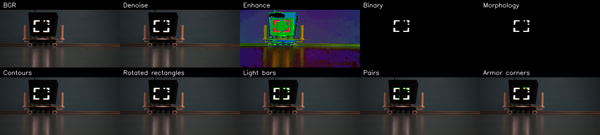
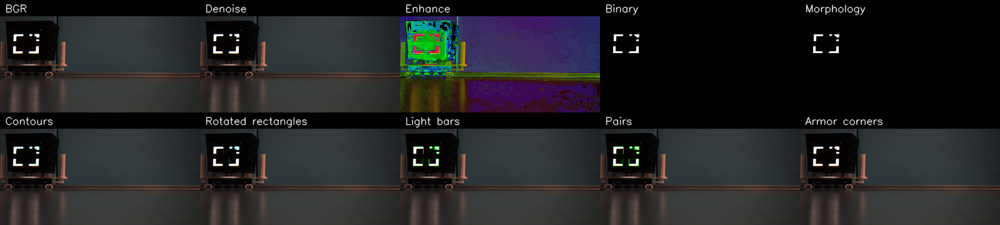
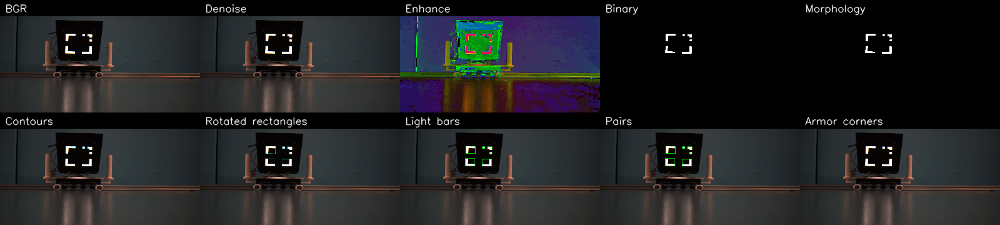
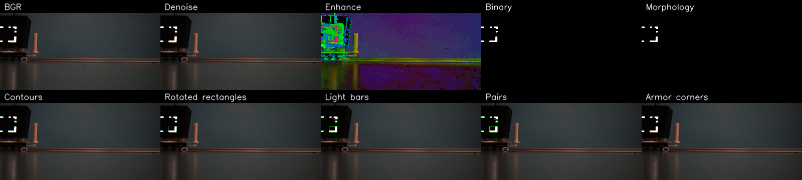

1.方法流程：（参数参考deepseek）
中值滤波去噪，BGR转hsv提取高亮，形态学开闭，轮廓提取，旋转矩形拟合，筛选过程（画图感觉），配对（边缘密度和打分）
2.参数
高斯/中值滤波窗口：3×3
白色 HSV 阈值：[0, 0, 180] 到 [180, 60, 255]
最小轮廓面积：15
长宽比下限：1.9
配对综合得分权重：间距 1.5、高度差 2.0、角度差 1.0、长度差 0.5
3.失败案例
findcounters有个死循环，颜色不对以为还是红蓝，边缘密度检测错误，illegal instruction
4.改进
改错误逻辑，改videowriter，用canny

